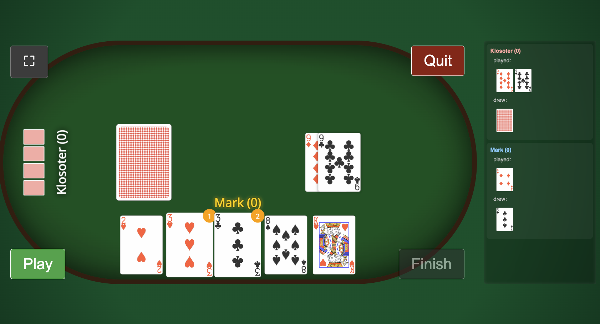

# Sub-Five — Multiplayer Card Game (Web-Based)


**Sub-Five** is a real-time, multiplayer card game implemented as a server-authoritative web application.

Currently it is hosted on (sub-five.klosoter.com)[https://sub-five.klosoter.com "Sub-Five"]

This repository is a systems-focused project: the goal is correctness, determinism, and clear separation between **game rules**, **state management**, and **UI rendering** — not frontend abstraction or visual polish.

---

## What This Project Demonstrates (for Recruiters)

This codebase shows:

- Server-authoritative multiplayer game logic
- Turn enforcement and validation
- Stateful room and session handling
- Non-trivial card-game rules with scoring and penalties
- A thin client that cannot cheat
- Production-style deployment (Docker + Fly.io)

The emphasis is on **logic and state**, not frameworks.

---

## Tech Stack

**Backend**
- Python
- Flask
- Redis (room and game state)
- Gunicorn

**Frontend**
- HTML templates (Jinja)
- Vanilla JavaScript
- Custom CSS (table-centric layout)

**Infrastructure**
- Docker
- Fly.io

---

## Architecture (High Level)

- **Server is authoritative**
  - All rules, turn checks, scoring, and penalties live in `game.py`
  - Client actions are validated before state mutation
- **Rooms**
  - Players create or join rooms via a lobby
  - Each room owns exactly one `Game` instance
- **State**
  - Stored centrally (Redis-backed)
  - No client-side trust
- **Frontend**
  - Renders server state
  - Sends explicit player actions only

---

## Game Rules (Sub-Five)

This is not a generic card game. The rules are specific and implemented directly in code.

### Deck
- Standard 52-card deck
- 2 Jokers (red ♥, black ♠)
- Jokers have the highest rank and special behavior

### Goal
End each round with the **lowest possible hand value**.
Across rounds, accumulate the **lowest total score**.

### Card Values
- Ace = 1
- 2–10 = face value
- J = 11, Q = 12, K = 13
- Joker = 0

### Setup
- Players are dealt a fixed number of cards
- One deck and one discard pile exist

### Turn Rules
On your turn, you must:
1. Play **one or more cards of the same rank** or **a valid series of the same suit (or jokers) and at least 3 cards **
2. Take a card from the deck or the top of the pile (after playing but before adding your own cards to the pile)

Turn order is strictly enforced server-side.

### Round End
The round ends when:
- A player's hand value is 5 or less and the player decides to end the round

### Scoring
- Hand values are summed at round end
- The player with the **lowest hand value** scores **0**
- All others add their hand value to their total score
- If the player who ends the round does not have the lowest hand value, he receives a 15 point penalty on top of his hand value. The player(s) who **do** have the lowest hand value score **0**

### Game End
- The game ends if one or more players have more than 100 points
- The player(s) with the lowest total score win the game

---

## Project Structure

```
Sub-Five/
├── server.py        # Flask app, routing, room/session lifecycle
├── game.py          # Core game rules, scoring, penalties
├── requirements.txt
├── Dockerfile
├── Procfile
├── fly.toml
├── static/
│   ├── css/
│   ├── js/
│   └── assets/
└── templates/
    ├── lobby.html
    ├── join.html
    └── game.html
```

---

## Running Locally

```bash
python -m venv venv
source venv/bin/activate
pip install -r requirements.txt
python server.py
```

Open:

```
http://localhost:5000
```

---

## Deployment

Configured for Fly.io:

```bash
fly launch
fly deploy
```

Gunicorn is used in production.

---

## Known Constraints

- No authentication (session-based players only)
- No persistent match history
- Desktop-first layout

These are deliberate trade-offs to keep focus on **game correctness and multiplayer state management**.

---

## License

MIT
